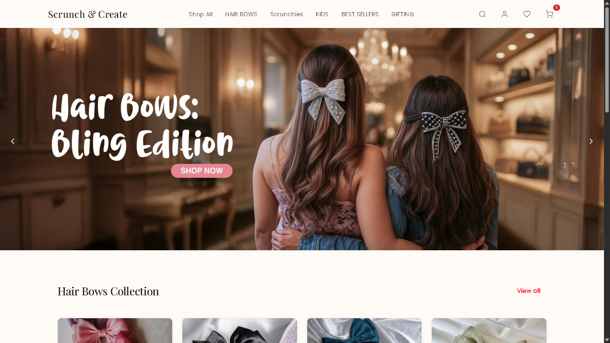

# 🎀 Scrunch & Create - E-commerce Platform

A modern, fully responsive e-commerce application for **Scrunch & Create**, a boutique brand specializing in handmade scrunchies and decorative hair bows. Built with React, Vite, and styled with modern CSS modules.

## ✨ Features

- **🛍️ Product Catalog**: Browse an extensive collection of handmade scrunchies and hair bows
  - Scrunchies (various styles including Tulip Scrunchies)
  - Hair Bows (Satin, Velvet, Sheer Satin, Jimmi Choo, and more)
  
- **🎨 User Authentication**: 
  - Sign Up & Sign In pages
  - User Profile management
  
- **🛒 Smart Shopping Cart**: 
  - Add/remove items with ease
  - Cart persistence using context
  - Real-time quantity management
  
- **📱 Fully Responsive Design**: Optimized for mobile, tablet, and desktop devices

- **🔍 Advanced Filtering**: Filter products by category and type

- **⚡ Toast Notifications**: Real-time user feedback for actions

- **🚀 Fast Performance**: Built with Vite for lightning-fast load times

## 📸 Screenshots

Here's a preview of the Scrunch & Create website:



## 🛠️ Tech Stack

- **Frontend Framework**: React 19
- **Build Tool**: Vite 7
- **Styling**: CSS Modules
- **Routing**: React Router DOM 7
- **Animation**: Framer Motion 12
- **State Management**: React Context API
- **Package Manager**: npm

## 📦 Installation & Setup

1. **Clone the repository**
   ```bash
   git clone https://github.com/danishansari-dev/scrunchcreate.git
   cd scrunchcreate
   ```
   
2. **Install dependencies**
   ```bash
   npm install
   ```

3. **Start the development server**
   ```bash
   npm run dev
   ```
   The application will open at `http://localhost:5173`

4. **Build for production**
   ```bash
   npm run build
   ```

5. **Preview production build**
   ```bash
   npm run preview
   ```

## 🏗️ Project Structure

```
scrunchcreate/
├── src/
│   ├── assets/                    # Static assets
│   │   ├── products/              # Product images
│   │   │   ├── Hairbows/          # Hair bow products
│   │   │   │   ├── Jimmi Choo Hair Bow/
│   │   │   │   ├── Satin Hair Bow/
│   │   │   │   ├── Satin Scarf Hairbow/
│   │   │   │   ├── Sheer Satin Hair Bow/
│   │   │   │   └── Velvet Hair Bow/
│   │   │   └── Scrunchies/        # Scrunchie products
│   │   │       ├── Scrunchies/
│   │   │       └── Tulip Scrunchie/
│   │   ├── slider1.png, slider2.png, slider3.png  # Banner images
│   │   └── react.svg              # Logo
│   │
│   ├── componets/                 # Reusable components
│   │   ├── banner/                # Hero banner component
│   │   ├── navbar/                # Navigation bar
│   │   ├── footer/                # Footer component
│   │   ├── productlist/           # Product listing component
│   │   ├── filtersidebar/         # Product filter sidebar
│   │   ├── cart/                  # Cart context
│   │   └── toast/                 # Toast notification context
│   │
│   ├── pages/                     # Page components
│   │   ├── home/                  # Home page
│   │   ├── products/              # Products listing page
│   │   ├── cart/                  # Shopping cart page
│   │   ├── auth/                  # Authentication pages
│   │   │   ├── SignIn.jsx
│   │   │   └── SignUp.jsx
│   │   └── profile/               # User profile page
│   │
│   ├── App.jsx                    # Main application component
│   ├── App.css                    # Global styles
│   ├── index.css                  # Base styles
│   └── main.jsx                   # Entry point
│
├── public/                        # Public assets
│   ├── _redirects                 # Netlify redirects
│   ├── logotitle.png              # Logo variations
│   ├── logotitle2.png
│   └── logotitle3.png
│
├── package.json                   # Project dependencies
├── vite.config.js                 # Vite configuration
├── eslint.config.js               # ESLint rules
└── index.html                     # HTML entry point
```

## 🎯 Key Components

### Navigation & Layout
- **NavBar**: Main navigation with branding and menu
- **Banner**: Hero section with product showcases
- **Footer**: Contact and company information

### Product Management
- **ProductList**: Displays products with images and details
- **FilterSidebar**: Advanced filtering options
- **productsData.js**: Product catalog data

### User Features
- **Cart**: Shopping cart functionality with context API
- **Authentication**: Sign In and Sign Up pages
- **Profile**: User profile management
- **Toast Notifications**: Real-time feedback system

## 🎨 Styling

The project uses **CSS Modules** for component-scoped styling, ensuring:
- No CSS conflicts
- Easy component maintenance
- Responsive design with mobile-first approach

## 🚀 Available Scripts

```bash
npm run dev       # Start development server
npm run build     # Build for production
npm run preview   # Preview production build
npm run lint      # Run ESLint
```

## 🛍️ Product Categories

### Hair Bows
- **Jimmi Choo Hair Bow** - Premium luxury bow
- **Satin Hair Bow** - Classic elegance
- **Satin Scarf Hairbow** - Stylish scarf bow
- **Sheer Satin Hair Bow** - Delicate and sophisticated
- **Velvet Hair Bow** - Soft velvet texture

### Scrunchies
- **Standard Scrunchies** - Variety of colors and styles
- **Tulip Scrunchie** - Unique petal-shaped design

## � Pages Overview

### Home Page (`/`)
- Hero banner with product showcase
- Featured products and collections
- Brand highlights and promotions

### Products Page (`/products`)
- Complete product catalog
- Advanced filtering by category
- Product grid with pricing
- Add to cart functionality

### Shopping Cart (`/cart`)
- View cart items
- Manage quantities
- Calculate totals
- Proceed to checkout

### Authentication
- **Sign In** (`/signin`) - Login for existing users
- **Sign Up** (`/signup`) - Register new accounts

### User Profile (`/profile`)
- User account management
- Order history
- Account settings

## 🔧 Getting Started

### Prerequisites
- Node.js (v14 or higher)
- npm or yarn

### Development Workflow
```bash
# Start development with hot module replacement
npm run dev

# Build optimized production bundle
npm run build

# Check code quality
npm run lint

# Preview production build locally
npm run preview
```

## 📝 Environment Setup

1. Ensure you have Node.js installed
2. Install dependencies with `npm install`
3. Create necessary environment variables if needed
4. Start the development server with `npm run dev`

## 🤝 Contributing

Feel free to submit issues and enhancement requests!

## 📄 License

This project is private and for Scrunch & Create brand use only.

## 👥 Author

**Scrunch & Create Team**

For inquiries about custom orders or collaborations, please reach out through the contact form on the website.

### Contact (`/contact`)
- Contact form with validation
- Contact information
- Social media links
- FAQ section

## 🛍️ Product Data Structure

```javascript
{
  id: 1,
  name: "Product Name",
  category: "scrunchies|bows|premium|combos",
  price: 299,
  originalPrice: 399, // for sale items
  colors: ["blush-pink", "lavender"],
  images: ["url1", "url2"],
  description: "Product description",
  material: "100% Silk",
  size: "One Size Fits All",
  inStock: true,
  featured: true,
  tags: ["silk", "premium"]
}
```

## 🔧 Customization

### Adding Products
Edit `src/data/products.js` to add new products:

```javascript
{
  id: 9,
  name: "New Product",
  category: "scrunchies",
  price: 199,
  colors: ["blush-pink"],
  images: ["image-url"],
  description: "Product description",
  material: "100% Cotton",
  size: "One Size Fits All",
  inStock: true,
  featured: false,
  tags: ["cotton", "new"]
}
```

### Styling
- Modify `tailwind.config.js` for color changes
- Update `src/index.css` for custom component styles
- Use Tailwind utility classes for layout changes

### Images
Replace placeholder images with your actual product photos:
- Update image URLs in `products.js`
- Use consistent aspect ratios (1:1 recommended)
- Optimize images for web (compress, resize)

## 🚀 Deployment

### Build for Production
```bash
npm run build
```

### Deploy Options
- **Vercel**: Connect GitHub repository for automatic deployment
- **Netlify**: Drag and drop `dist` folder
- **GitHub Pages**: Use GitHub Actions for deployment
- **Firebase Hosting**: Use Firebase CLI

## 🔌 Backend Integration

This is a frontend-only implementation. To integrate with a backend:

1. **Replace dummy data** with API calls
2. **Add authentication** for user accounts
3. **Integrate payment gateway** (Stripe, Razorpay)
4. **Add order management** system
5. **Implement inventory tracking**

## 📄 License

This project is created for Scrunch & Create brand. Customize and use as needed.

## 🤝 Contributing

1. Fork the repository
2. Create a feature branch
3. Make your changes
4. Test thoroughly
5. Submit a pull request


## 🔄 CI/CD Pipeline (Academic Project)

**Note:** This is a simplified CI/CD setup for academic/demo purposes only.

This project includes a basic **automated CI/CD pipeline** using Jenkins and Docker.

### Pipeline Stages

1. **Checkout** - Clone repository from GitHub
2. **Environment Setup** - Verify Node.js, npm, and Docker versions
3. **Install Dependencies** - Install npm packages
4. **Lint** - Code quality checks with ESLint
5. **Build** - Compile React application with Vite
6. **Test** - Placeholder for tests
7. **Build Docker Image** - Create Docker container image
8. **Deploy to Localhost** - Deploy to localhost:4173

### DevOps Layout
```
devops/
├── Jenkinsfile
├── docker/
│   ├── Dockerfile
│   └── docker-compose.yml
└── docs/
    └── CI_CD_SETUP_GUIDE.md
```

### Quick Start

#### Build Docker Image
```bash
docker build -f devops/docker/Dockerfile -t scrunchcreate:latest .
```

#### Run with Docker Compose
```bash
docker-compose -f devops/docker/docker-compose.yml up -d --build
```

#### Access Application
- **URL**: http://localhost:4173

### Jenkins Configuration

1. **Create Jenkins Job:**
   - New Item → Pipeline
   - Select "Pipeline script from SCM"
   - Repository URL: `https://github.com/danishansari-dev/scrunchcreate.git`
   - Script Path: `devops/Jenkinsfile`

2. **Required Plugins:**
   - GitHub Integration Plugin
   - Docker Plugin
   - Docker Compose Plugin

3. **GitHub Webhook Setup:**
   - Repository Settings → Webhooks
   - URL: `http://jenkins-server/github-webhook/`
   - Events: Push events

### Local Development with Docker

```bash
# Build and start
docker-compose -f devops/docker/docker-compose.yml up -d --build

# View logs
docker-compose -f devops/docker/docker-compose.yml logs -f

# Stop
docker-compose -f devops/docker/docker-compose.yml down
```

### Troubleshooting

**Container won't start**
```bash
# Check logs
docker-compose -f devops/docker/docker-compose.yml logs

# Rebuild
docker-compose -f devops/docker/docker-compose.yml build --no-cache
```

## ✉️ Contact

For any questions, feedback, or collaboration opportunities, please feel free to reach out at:  
📧 **[danishansari.dev@gmail.com](mailto:danishansari.dev@gmail.com)**

**Made with ❤️ for Scrunch & Create**

