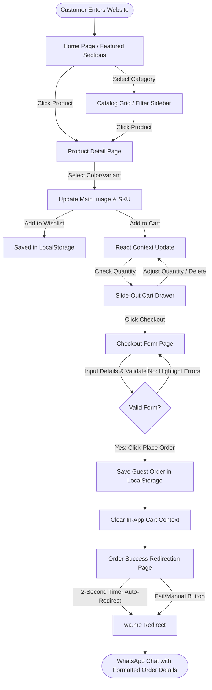
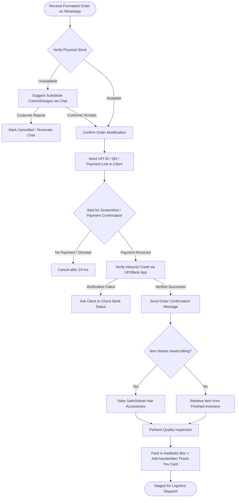
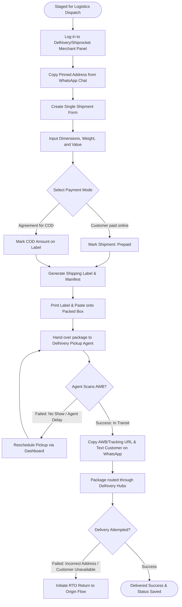
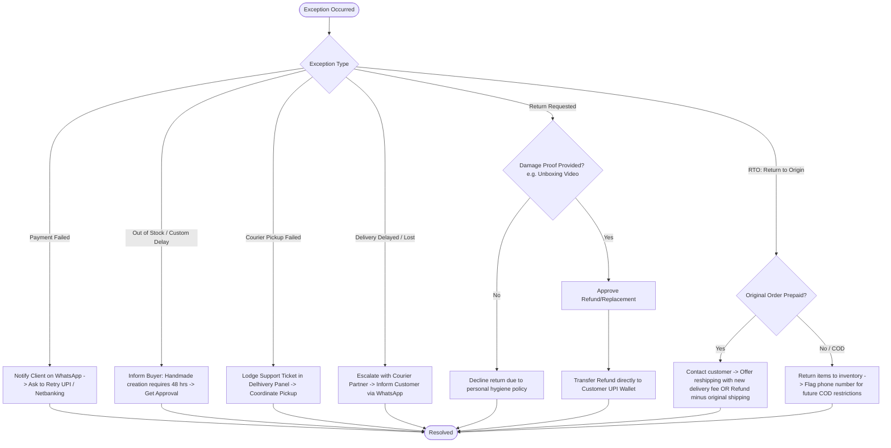
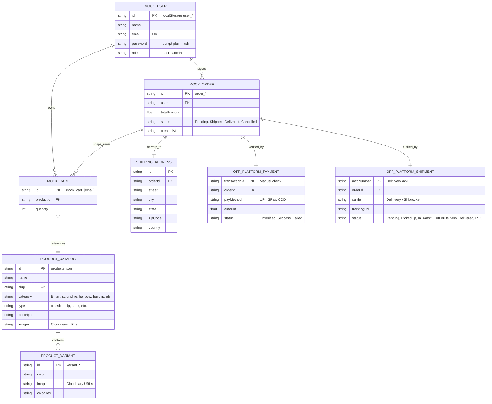

# 🎀 Scrunch & Create — Business Operations & User Flow Analysis
**Date:** June 19, 2026  
**Auditor:** Antigravity (Google DeepMind Agentic Coding Team)  
**Status:** Complete Audit & Verification  

---

## A. Executive Summary

Scrunch & Create is an artisanal, direct-to-consumer (D2C) brand specializing in handmade hair accessories (scrunchies, bows, clips) and gift hampers. Following an audit of the codebase, we have verified that the system operates as a **hybrid e-commerce model**:

1. **On-Platform (Storefront App):** A React 19 + Vite 7 Single Page Application (SPA) hosted on Vercel. It features full catalog navigation, search, wishlist management, a client-side cart, and a checkout details form. Due to decoupling from the Node/Express backend, the frontend utilizes a simulated service layer (`src/services/api.js`) storing data in browser `localStorage`.
2. **Off-Platform (Conversational Fulfillment):** Order submission terminates in a **WhatsApp-based checkout funnel**. Clicking "Place Order" generates a pre-formatted WhatsApp chat text payload containing the cart items, subtotal, delivery charges, and shipping address, and redirects the browser to the boutique owner's WhatsApp number (`+91 7300969491`).
3. **Logistics & Admin Operations:** Since there is no live backend database sync or automated shipping APIs connected, payment validation, inventory tracking, packaging, Delhivery shipping bookings, and customer support are performed **manually** by the boutique owner off-platform.

This report documents the end-to-end user journeys, admin procedures, operations, logistics, and exception handling, mapped directly against the codebase.

---

## B. High-Level Architecture Diagram

The diagram below illustrates the actual current deployment and operational topology of the Scrunch & Create business.

```mermaid
graph TD
    %% Define Styles
    classDef client fill:#FFF0F5,stroke:#DB7093,stroke-width:2px;
    classDef cloud fill:#E6F2FF,stroke:#0066CC,stroke-width:2px;
    classDef manual fill:#FFF5E6,stroke:#E68A00,stroke-width:2px;
    classDef thirdparty fill:#EBF9EB,stroke:#2EB82E,stroke-width:2px;

    %% Nodes
    Customer([Customer Browser]):::client
    Vercel[Vercel Edge Network<br/>Vite Static Files]:::cloud
    Cloudinary[Cloudinary Image CDN<br/>WebP Product Assets]:::cloud
    LocalStorage[(Browser LocalStorage<br/>Mock Cart/Orders/Wishlist)]:::client
    WhatsAppLink[WhatsApp Deep-Link<br/>wa.me/917300969491]:::client
    
    WhatsAppWeb[WhatsApp Chat Channel<br/>Conversational Checkout]:::thirdparty
    UPI[UPI/GPay/NetBanking<br/>Manual Payment Verification]:::thirdparty
    OwnerPanel[Boutique Owner / Operations<br/>Manual Product Prep & Packing]:::manual
    DelhiveryPanel[Delhivery Merchant Panel<br/>Manual Shipment Booking]:::thirdparty
    Courier[Delhivery Courier Agent<br/>Doorstep Pickup & Delivery]:::thirdparty

    %% Flows
    Customer -->|Fetches Static Assets| Vercel
    Customer -->|Displays CDN Images| Cloudinary
    Customer -->|Reads/Writes Cart & Wishlist| LocalStorage
    Customer -->|Triggers Order Submission| LocalStorage
    Customer -->|Redirects to Checkout Link| WhatsAppLink
    
    WhatsAppLink -->|Loads Text Payload| WhatsAppWeb
    WhatsAppWeb <-->|1. Agree Payment & Color Details| OwnerPanel
    WhatsAppWeb -->|2. Share Payment Screenshot| OwnerPanel
    
    OwnerPanel -->|3. Verifies Transfer| UPI
    OwnerPanel -->|4. Checks Physical Stock| OwnerPanel
    OwnerPanel -->|5. Hand-crafts / Packs Items| OwnerPanel
    OwnerPanel -->|6. Copy-Paste Shipping Details| DelhiveryPanel
    
    DelhiveryPanel -->|7. Dispatches Agent| Courier
    Courier -->|8. Picks Up Parcel| OwnerPanel
    Courier -->|9. Doorstep Delivery| Customer
    OwnerPanel -->|10. Text Tracking Link (AWB)| WhatsAppWeb
```

---

## C. Detailed Business Flows

### 1. User Flow (Browsing to WhatsApp Redirection)
Maps the customer's navigation through the React SPA.



### 2. Admin & Operations Flow
Outlines the manual backend tasks completed by the boutique owner to verify and package the order.



### 3. Logistics & Delivery Flow (Delhivery Shipping Integration)
Documents the manual integrations with logistics providers (Delhivery/Shiprocket) for booking and tracking.



### 4. Exception & Error Flow
Covers structural and user-initiated breaks in the standard commerce loop.



---

## D. Database Entity Relationship Overview (ERD)

This entity diagram shows the conceptual data relationships, outlining which properties are loaded from local config files, stored in `localStorage`, or logged off-platform in spreadsheets or shipping dashboards.



---

## E. API Interaction Map

This map outlines the current frontend mock API endpoints and details where data is stored client-side vs. what remains manual.

```
                  ┌──────────────────────────────────────────────────────────┐
                  │                 CLIENT-SIDE REACT SPA                    │
                  └───────────────┬──────────────────────────┬───────────────┘
                                  │                          │
              Requests to Mock APIs                      Routing/Page state
                                  │                          │
                                  ▼                          ▼
                  ┌────────────────────────┐    ┌────────────────────────────┐
                  │   src/services/api.js  │    │     React Router Dom       │
                  └───────┬────────┬───────┘    └────────────────────────────┘
                          │        │
     Reads/Writes mock db │        │ Prepares data for redirect
                          │        │
                          ▼        ▼
 ┌───────────────────────────┐  ┌────────────────────────────────────────────┐
 │    Browser LocalStorage   │  │   whatsappUtils.js (generateWhatsAppLink)  │
 ├───────────────────────────┤  ├────────────────────────────────────────────┤
 │ - mock_users              │  │ Evaluates:                                 │
 │ - mock_cart_[email]       │  │ - subtotal                                 │
 │ - mock_orders_[email]     │  │ - shipping charge (Free >= 499, else 49)   │
 │ - last_order              │  │ - Formats address & items into text        │
 │ - wishlist                │  │ - Appends: https://wa.me/917300969491      │
 └───────────────────────────┘  └─────────────────────┬──────────────────────┘
                                                      │
                                                      │ Redirects customer
                                                      ▼
                                ┌────────────────────────────────────────────┐
                                │             WhatsApp Messenger             │
                                └────────────────────────────────────────────┘
```

---

## F. Bottlenecks & Redundant Steps

During our review of the end-to-end user flow, we identified several operational bottlenecks:

1. **Manual Address Transcribing (High Risk):** The boutique owner must manually copy the shipping address from the WhatsApp chat window and paste it line-by-line into the Delhivery or Shiprocket merchant dashboard. This is slow and prone to formatting errors, leading to delivery failures.
2. **Offline Payment Verification Delay:** Because payments are made manually via UPI transfers, orders cannot be processed until the boutique owner manually verifies receipt in their bank app. This delays shipping and can lead to cart abandonment if the buyer forgets to send the confirmation screenshot.
3. **Absence of Real-time Inventory Sync:** Handcrafted items are marked as "In Stock" by default in the JSON file. If a viral social media spike occurs, the owner could receive more orders for a specific fabric color than they have material for. Resolving this requires manual WhatsApp messaging, leading to custom wait times.
4. **Manual Tracking Sharing:** After booking a courier pickup, the owner has to copy the AWB/tracking link from the logistics portal and manually text it to the customer on WhatsApp.

---

## G. Optimization Recommendations

To resolve the operational bottlenecks and scale the business, we recommend implementing the following automation steps:

| Target Area | Current Manual Process | Proposed Automation Path |
| --- | --- | --- |
| **Payment Collection** | Share UPI ID/QR -> verify in bank app -> confirm chat. | **Razorpay/Instamojo Integration:** Add a lightweight checkout web view. The customer pays in-app, and the status updates immediately. |
| **Logistics Booking** | Copy address from WhatsApp -> paste into Delhivery panel. | **Delhivery/Shiprocket API Booking:** On order placement, call the Delhivery API automatically to create the shipment, generate the label, and email/WhatsApp it to the admin. |
| **Tracking Updates** | Copy AWB tracking URL -> paste into chat. | **Automated WhatsApp Webhooks:** Integrate with a platform like WATI or Twilio API. When Delhivery updates the tracking status, send automated tracking alerts to the customer. |
| **Inventory Control** | No stock checking -> manual messaging for substitutes. | **Database-backed Admin Dashboard:** Re-enable the Node/Express backend with MongoDB. Create a simple admin page to update inventory count, disabling purchase buttons on the frontend when stock is zero. |

---

## H. Gaps & Missing Workflows Detected

We identified several missing workflows in the codebase:

- **Missing Admin Dashboard:** Although there is role-based middleware (`authorize('admin')`) in the backend architecture specifications, the frontend currently has no admin routing, login interface, or product editor.
- **No Real-time Stock Checks:** The storefront doesn't verify inventory quantities before permitting additions to the cart, relying on the client-side JSON file.
- **Lack of Local Delivery Options:** The checkout form does not allow the customer to choose local courier options (e.g. Dunzo/Porter for immediate shipping in the owner's city) or express shipping.
- **No Direct Support Ticket System:** Customer support relies entirely on open chat. If a parcel is damaged, there is no formal ticket or resolution history.

---

## I. Detailed Decision Tree Nodes

Below is the structured logic for the primary business decisions:

### 1. Payment Processing (COD vs Prepaid)
```
          [ Place Order Selected ]
                     │
            Is Pincode Eligible?
             /              \
         (No)                (Yes)
           │                   │
  Prepaid Only Required     Choose Payment Mode
                             /              \
                     (Prepaid)              (COD)
                         │                     │
               Initiate UPI/Gateway     Set COD Amount on label
                  /            \               │
           (Success)          (Fail)      Pack package
               │                │              │
          Pack package     Request Retry  Manifest handover
```

### 2. Stock Allocation
```
              [ Checkout Completed ]
                        │
             Check physical materials
               /                \
         (Available)        (Unavailable)
             │                     │
      Confirm Order         Contact client
             │              /            \
       Pack & Dispatch  (Accept)       (Cancel)
                           │               │
                     Craft item     Refund/Close
```

### 3. Courier & Delivery Handover
```
             [ Packaged Box Ready ]
                        │
            Book Delhivery / Shiprocket
                        │
            Print label & schedule pickup
                        │
               Pickup Agent Arrives
               /                 \
         (Success)             (Failed)
             │                     │
       Scan AWB label       Reschedule in portal
             │                     │
       Set In Transit       Investigate delay
```
